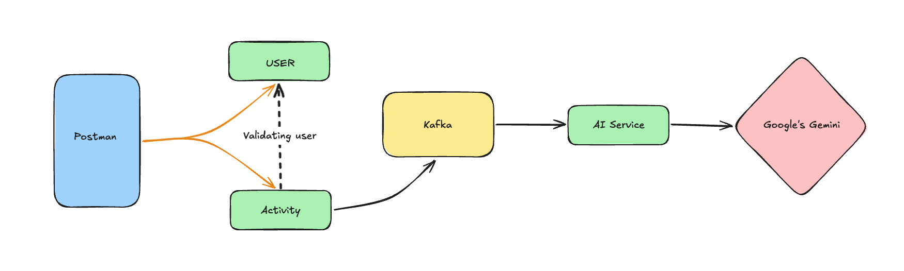

# 🏋️ Fitness Microservices Architecture

This project follows an **event-driven microservices architecture** for tracking user fitness activities and generating AI-powered recommendations using **Google Gemini**.

## Architecture Diagram



## System Flow

### 1. User Registration
- User details are registered through the **User Service**.
- User data is persisted in the database.

### 2. Activity Tracking
- Activity data (Running, Walking, Cycling, etc.) is sent to the **Activity Service** via API requests.
- 
### 3. User Validation
Before saving an activity:

- The **Activity Service** validates whether the user exists.
- Inter-service communication happens through **REST API calls**.

```text
Activity Service → User Service → Validate User
```

### 4. Event Publishing using Kafka
Once the activity is successfully saved:

- The **Activity Service** publishes an event to **Kafka**.
- This makes the architecture asynchronous and loosely coupled.

```text
Activity Service → Kafka Topic
```

### 5. AI Recommendation Generation
The **AI Service** consumes Kafka events and:

- Reads activity information
- Creates an AI prompt
- Sends the prompt to **Google Gemini**

```text
Kafka → AI Service → Google Gemini
```

### 6. Recommendation Storage
The generated recommendation is:

- Parsed
- Processed
- Stored for later retrieval

Users can then fetch personalized fitness recommendations.

---

## High-Level Workflow

```text
Postman / Client
        ↓
User Service ← Validation → Activity Service
                                ↓
                             Kafka
                                ↓
                           AI Service
                                ↓
                         Google Gemini
                                ↓
                     Fitness Recommendation
```

## Tech Stack

- **Spring Boot** → Microservices
- **Spring WebClient** → Inter-service communication
- **Apache Kafka** → Event-driven messaging
- **Google Gemini API** → AI-powered recommendations
- **MongoDB** → Data persistence
- **Eureka Server** → Service discovery
- **Docker** *(optional if added)*
